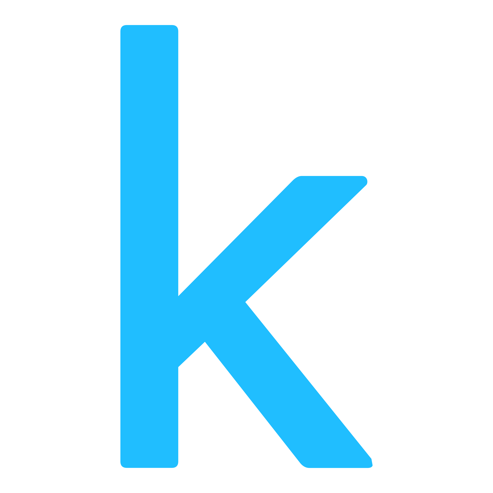
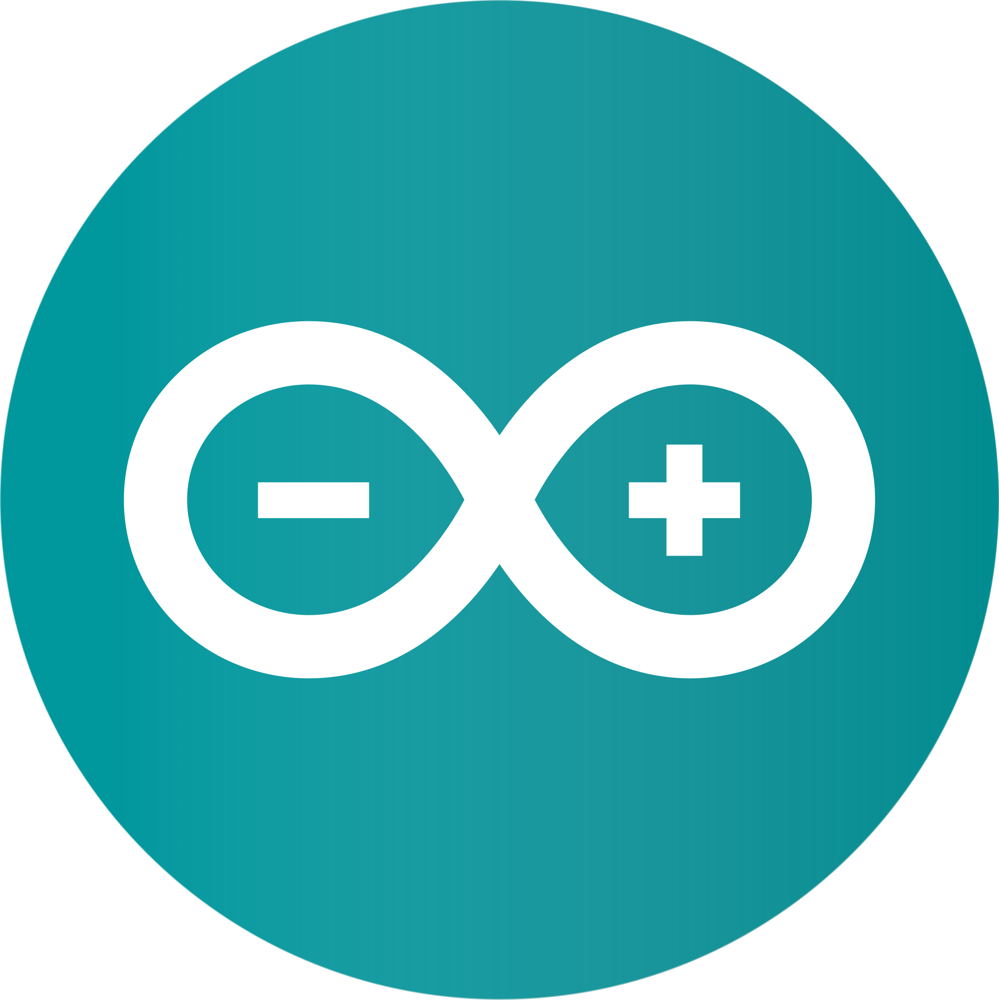

- 🔭   &emsp;   🌱    &emsp;   👯   &emsp;    🤔   &emsp;    💬   &emsp;    📫   &emsp;    😄    &emsp;   ⚡Fun Fact: 

<table>
  <tr>
    <td style="width: 50%; vertical-align: top; text-align: center;">
      <!-- Typing SVG Images -->
      
       
      
      

    </td>
    <td style="width: 50%; vertical-align: top; text-align: center;">
      <!-- Contact Icons -->
      
       
      
       
      
       
      
    </td>
    <td style="width: 50%; vertical-align: top; text-align: center;">
      <!-- Contact Icons -->
      
       
      
       
      
       
      
    </td>
    
  </tr>
</table>

<blockquote style="font-size: 50px; font-weight: bold; color:#123123;">
   If We Pull Together And Commit Ourselves, Then We Can Push Through Anything.
</blockquote>
 

  

    <blockquote style="font-size: 50px; font-weight: bold; color:#123123;">
      Die Fantasie beginnt 💫    
    </blockquote>
     
  

  <table>
    <tr>
      <!-- Programming Languages -->
      <td>
        

          

            <blockquote style="font-size: 50px; font-weight: bold; color:#123123;">
              Programming Languages
            </blockquote>
          

          
          <table>
            <tr>
              <td style="text-align: center;"> </td>
              <td style="text-align: center;"></td>
              <td style="text-align: center;"></td>
              <td style="text-align: center;"></td>
              <td style="text-align: center;"></td></tr>
          </table>
        

      </td>
      <!-- IDE Software -->
      <td>
        

          

            <blockquote style="font-size: 50px; font-weight: bold; color:#123123;">
              IDE Software
            </blockquote>
          

          
          <table>
            <tr>
              <td style="text-align:center;"></td>
              <td style="text-align:center;"></td>
              <td></td>
              <td></td>
              <td></td>
              <td></td>
              <td></td>
              <td></td>
              <td></td>
              <td style="text-align:center;"></td>
              <td style="text-align:center;"></td>
            </tr>
          </table>
        

      </td>
      <!-- Frameworks -->
      <td>
        

          

            <blockquote style="font-size: 50px; font-weight: bold; color:#123123;">
              Frameworks & Libraries 
            </blockquote>
          

          
          <table>
            <tr>
                <td style="text-align:center;"></td>  
                <td style="text-align:center;"></td>  
                <td style="text-align:center;"></td>  
                <td style="text-align:center;"></td>  
                <td style="text-align:center;"></td>
                <td style="text-align:center;"></td>
                <td style="text-align:center;"></td>
                <td style="text-align:center;"></td>
                <td style="text-align:center;"></td>
                <td style="text-align:center;"></td>
                <td style="text-align:center;"></td>
                <td style="text-align:center;"></td>
               <td style="text-align:center;"></td>
               <td style="text-align:center;"></td>
               <td style="text-align:center;"></td>
               <td style="text-align:center;"></td>
               <td style="text-align:center;"></td>
              <td style="text-align:center;"></td>
              <td style="text-align:center;"></td>
              <td style="text-align:center;"></td>
               <td style="text-align:center;"></td>
               <td style="text-align:center;"></td>
              <td style="text-align:center;"></td>
            </tr>
          </table>
        

      </td>
      <!-- Cloud & Development Platforms -->
      <td>
        

          

            <blockquote style="font-size: 50px; font-weight: bold; color:#123123;">
              Cloud & Development Platforms
            </blockquote>
          

          
          <table>
            <tr> 
                  <td style="text-align:center;"></td>
                  <td style="text-align:center;"></td>
                  <td style="text-align:center;"></td>
                  <td></td>
                  <td style="text-align:center;"></td>
                  <td style="text-align:center;"></td>
            </tr>
          </table>
        

      </td>
    </tr>
  </table>

 

  
  

    <h1>Operating Systems</h1>
    
  

  

    
  

