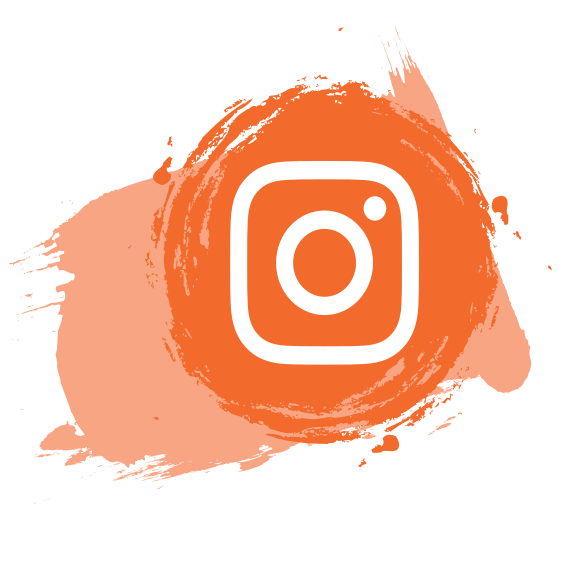

<table>
  <tr>
    <td style="width: 50%; vertical-align: top; text-align: center;">
      <!-- Typing SVG Images -->
      
       
      
      

    </td>
    <td style="width: 50%; vertical-align: top; text-align: center;">
      <!-- Contact Icons -->
      
       
      
       
      
       
      
    </td>
    <td style="width: 50%; vertical-align: top; text-align: center;">
      <!-- Contact Icons -->
      
       
      
       
       
      
    </td>
    
  </tr>
</table>

<blockquote style="font-size: 50px; font-weight: bold; color:#123123;">
   If We Pull Together And Commit Ourselves, Then We Can Push Through Anything.
</blockquote>

My top languages

| Rank | Languages |
|-----:|-----------|
|     1|    C      |
|     2|   C++     |
|     3|  PYTHON   |

<!-- Adjust appearance based on GitHub theme -->

